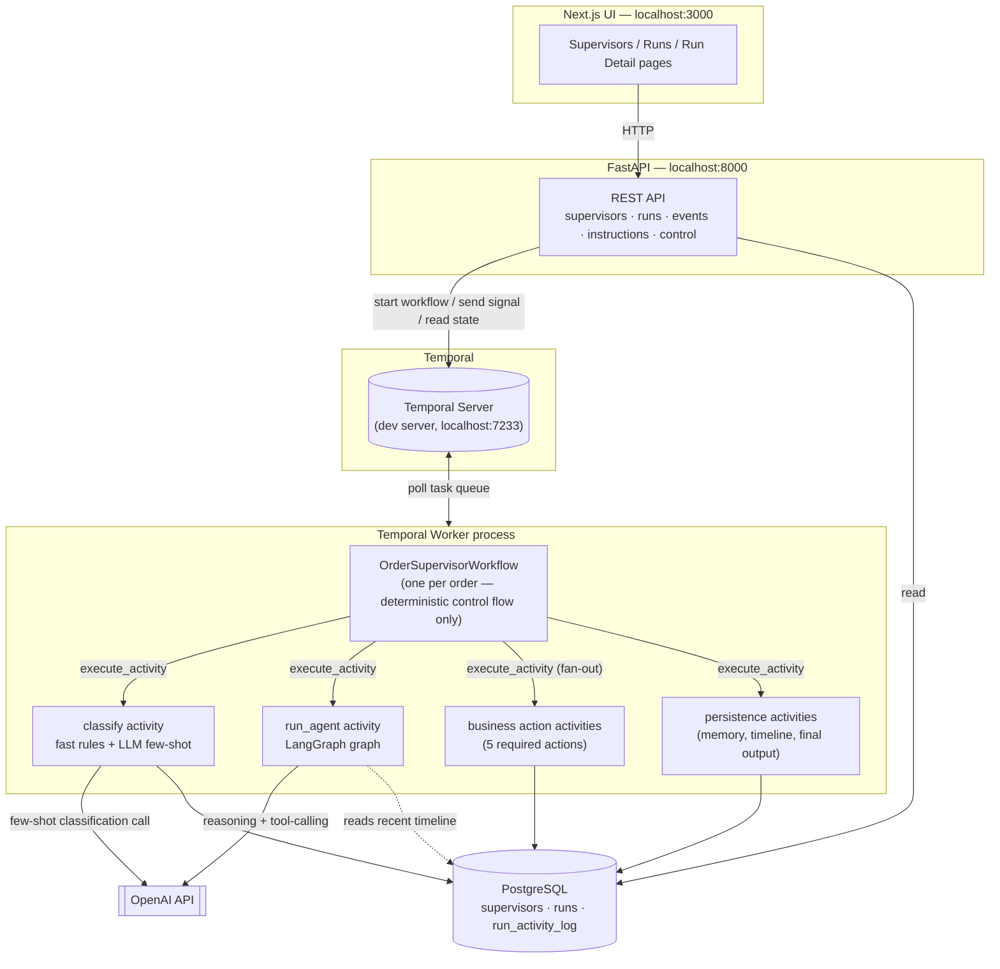
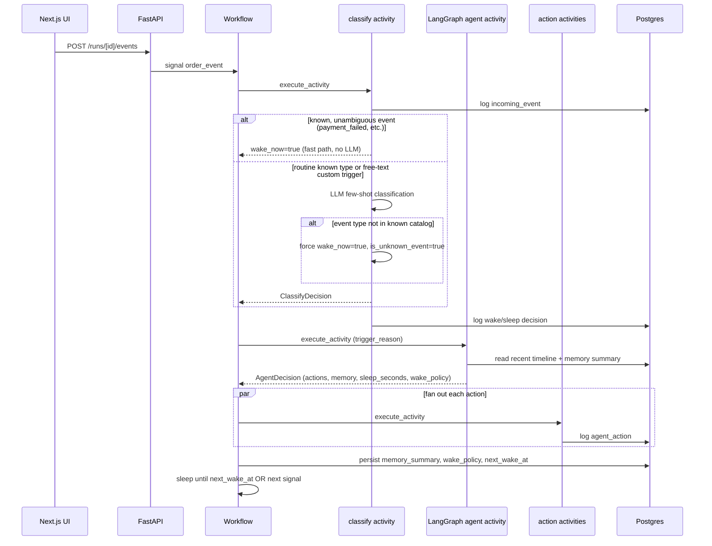

# Order Supervisor

A POC for a long-running AI supervisor that owns a single order's lifecycle, end to
end, on top of Temporal. One Temporal workflow runs per order; it reasons at three
triggers (workflow start, incoming signal, scheduled wake-up), never in a tight loop,
and sleeps in between.

See [`ARCHITECTURE.md`](./ARCHITECTURE.md) for the full design write-up and
[`WALKTHROUGH.md`](./WALKTHROUGH.md) for the recorded-demo script.

## Stack

- **Frontend**: Next.js (App Router) + Tailwind CSS
- **Backend**: Python, FastAPI
- **Orchestration**: Temporal Python SDK (`temporalio`)
- **Agent runtime**: LangGraph + LangChain (OpenAI)
- **Persistence**: PostgreSQL

## Architecture



**One agent turn, start to finish** (triggered by an incoming signal — the workflow-start
and scheduled-wake-up triggers skip straight to step 4):



## Prerequisites

- Python 3.12+ and [`uv`](https://docs.astral.sh/uv/)
- Node.js 20+ and `pnpm`
- [Temporal CLI](https://docs.temporal.io/cli) (`brew install temporal`) — for a local dev server
- A local PostgreSQL instance
- An OpenAI API key

## 1. Database

Create a database and apply the schema (adjust connection details to your local Postgres):

```bash
createdb order_supervisor
psql -d order_supervisor -c 'CREATE EXTENSION IF NOT EXISTS pgcrypto;'
psql -d order_supervisor -f backend/app/db/schema.sql
```

## 2. Backend

```bash
cd backend
uv sync
cp .env.example .env   # then fill in DATABASE_URL and OPENAI_API_KEY
```

`.env` fields:

| Variable | Description |
|---|---|
| `DATABASE_URL` | e.g. `postgresql+asyncpg://<user>@localhost:5432/order_supervisor` |
| `TEMPORAL_HOST` | defaults to `localhost:7233` |
| `TEMPORAL_NAMESPACE` | defaults to `default` |
| `TEMPORAL_TASK_QUEUE` | defaults to `order-supervisor-task-queue` |
| `OPENAI_API_KEY` | required for the agent runtime to actually reason |
| `DEFAULT_OPENAI_MODEL` | defaults to `gpt-4o-mini` |

Run three processes (separate terminals), in this order:

```bash
# 1. Temporal dev server
temporal server start-dev

# 2. Temporal worker — executes the workflow + all activities
cd backend && uv run python -m app.worker

# 3. FastAPI app — supervisor/run management API
cd backend && uv run uvicorn app.main:app --reload --port 8000
```

Temporal's local Web UI is available at `http://localhost:8233` — useful for watching
workflow history, signals, and activity fan-out live during a demo.

Run the backend test suite (no live Temporal server, DB, or OpenAI key required — uses
Temporal's time-skipping test environment with mocked activities):

```bash
cd backend && uv run pytest
```

## 3. Frontend

```bash
cd frontend
pnpm install
pnpm dev
```

Open `http://localhost:3000`. It talks to the FastAPI backend at
`http://localhost:8000` by default (see `frontend/.env.local` /
`NEXT_PUBLIC_API_BASE_URL` to change this).

## Using it

1. Go to **Supervisors**, create one (or use a preset) — name, base instruction,
   available actions, wake aggressiveness.
2. Go to **Runs**, start a run for an order ID against that supervisor.
3. Open the run's detail page: inject events from the dropdown (`payment_failed`,
   `shipment_delayed`, etc.) — or pick **custom…** and type any free-text event type
   of your own (see "Bonus items" below) — add a run-specific instruction, watch the
   timeline update, and pause/resume/terminate the run.
4. On termination (or a terminal order event like `delivered`, or hitting a
   configured max workflow age), the workflow produces a final summary, key
   learnings, and feedback.

## Bonus items ("Good-to-Have" from the spec)

Beyond the required scope, this implements:

- ✅ **Agent-generated wake-up guidance for the classifier** — after each turn the
  agent can refine the wake policy (e.g. widen it to include a new event type for this
  specific order), which is fed back into the classifier on the next incoming event.
- ✅ **Unknown-event escalation behavior** — event types aren't a closed enum on the
  wire. The UI's "Inject event" control has a **custom…** option for typing any
  free-text trigger. A small LLM classifier (see below) handles routine known types via
  few-shot examples in its system prompt; anything outside the system's known catalog
  is **force-escalated in code** (`wake_now=true`, `is_unknown_event=true`) regardless
  of what the LLM returns, so escalation of unrecognized input never depends on LLM
  reliability. The main agent then sees it was unrecognized and decides how to respond
  (in testing, it correctly called `message_logistics_team` and `create_internal_note`
  for a made-up `carrier_lost_package` event it had never seen before).
- ✅ **`continue_as_new` for very long histories** — triggered on an activity-log
  sequence-count threshold, carrying forward only compact state (not the full
  timeline, which lives in Postgres). Covered by an automated test that runs 300+
  simulated turns and asserts the epoch counter advances.
- ✅ **Multiple supervisor templates** — unlimited supervisor configs, plus two
  hardcoded presets to start from.
- ✅ **Richer memory-compaction strategy** — two layers on top of the baseline rolling
  summary (which the spec's own example already covers):
  1. **Importance-weighted timeline retention** (`_load_recent_timeline` in
     `agent_activity.py`): instead of a blind "last 30 rows" sliding window, business
     actions, manual instructions, final output, and unknown-event escalations are
     always kept within the lookback regardless of age; only routine entries (ordinary
     incoming events, non-escalated wake/sleep decisions, system bookkeeping) are capped
     to the most recent few. Older high-signal facts are assumed to already be folded
     into the agent's own `memory_summary` — this window is short-term detail, not
     long-term memory.
  2. **Second-pass summary compaction** (`app/agent/compaction.py`): if the agent's
     `memory_summary` itself grows past ~600 characters, one extra small LLM call
     compresses it back down before it's persisted, so a very long-running order
     doesn't end up feeding an ever-growing wall of prose into every future turn. Most
     turns never cross the threshold, so this adds no cost to the common case.

Not done (lower priority per the spec's own wording, and flagged rather than silently
skipped): a richer cross-run analytics view (an aggregate dashboard across all runs,
beyond the simple stat tiles already on the Runs page).

### The classifier, concretely

`backend/app/activities/classifier_activity.py` — a hybrid, not a single LLM call for
everything:

1. A handful of unambiguous, safety-critical event types (`payment_failed`,
   `shipment_delayed`, `refund_requested`, `customer_message_received`, `delivered`)
   always wake immediately via a **deterministic fast path** — zero LLM latency/cost.
2. An "aggressive" supervisor config wakes on anything, same fast path.
3. Everything else — routine known types *and* any custom text typed in the UI — goes
   through `ChatOpenAI(...).with_structured_output(ClassifyDecision)` with a system
   prompt built from a small set of **few-shot examples** (`_FEW_SHOT_EXAMPLES`)
   demonstrating how routine vs. important vs. unknown events should be classified,
   plus the run's current agent-authored wake policy as additional context.
4. If the event's type isn't in the system's known catalog, the code overrides the
   LLM's output to force `wake_now=true, is_unknown_event=true` — the LLM is still
   asked for a `reason` so the main agent gets a useful interpretation, but the
   escalation guarantee itself doesn't rely on the LLM getting it right.

## Deployment

No cloud deployment is required by this assignment (deliverables are source code, this
README, an architecture note, and a walkthrough video). Everything above runs locally.
Note also that a Temporal worker is a long-lived process that continuously polls a task
queue — it cannot run as a serverless/on-demand function (e.g. Vercel), regardless of
repo layout, so this project intentionally keeps the backend and frontend as separate
services rather than folding everything into one Next.js-deployable repo.
