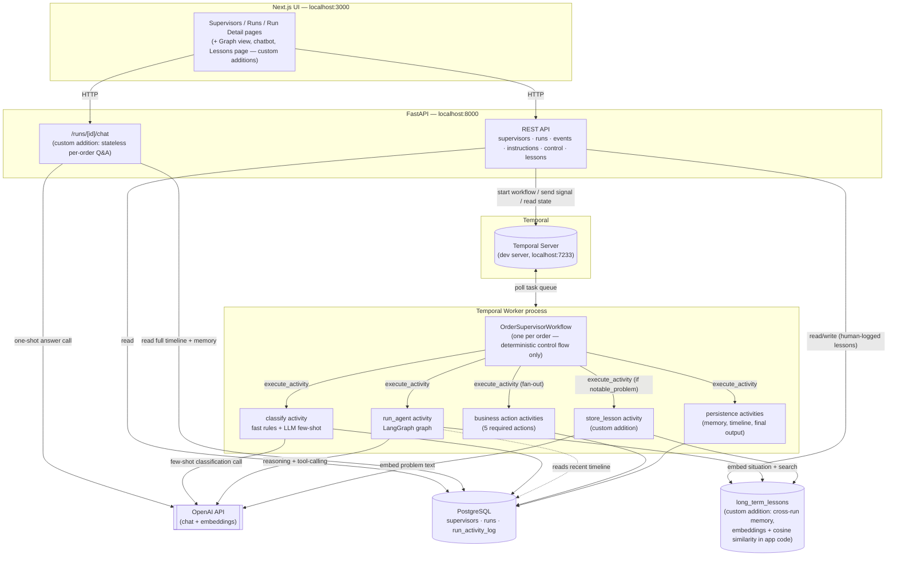
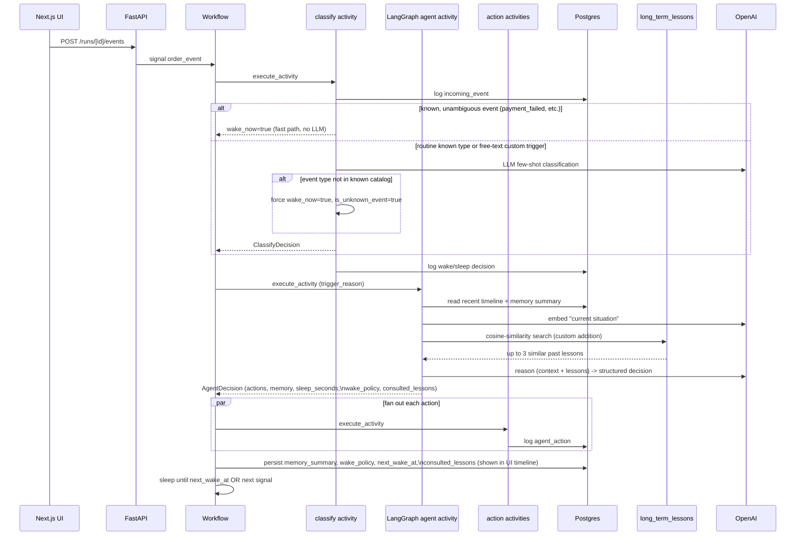

# Order Supervisor

A POC for a long-running AI supervisor that owns a single order's lifecycle, end to
end, on top of Temporal. One Temporal workflow runs per order; it reasons at three
triggers (workflow start, incoming signal, scheduled wake-up), never in a tight loop,
and sleeps in between.

See [`ARCHITECTURE.md`](./ARCHITECTURE.md) for the full design write-up and
[`WALKTHROUGH.md`](./WALKTHROUGH.md) for the recorded-demo script.

## What stands out

The required scope is fully implemented (below). On top of it, this adds a handful of
things that aren't in the spec at all — most notably a **cross-run, semantic
long-term-memory system** that lets one order's resolved problem help a completely
different order months later:

- 🧠 **Cross-run long-term memory** — embeddings + cosine-similarity search over past
  problem/resolution pairs, surfaced back into the agent's reasoning on unrelated
  future orders ([details](#1-cross-run-long-term-memory-semantic-not-just-tag-based)).
- 🙋 **Human-curated lessons with fault attribution** (our side / client side), sitting
  in the same memory store as the AI-inferred ones
  ([details](#2-human-curated-lessons-with-fault-attribution)).
- 📖 A dedicated **`/lessons` page** making that institutional memory visible and
  demoable, not just invisible plumbing ([details](#3-a-lessons-page--institutional-memory-made-visible)).
- 🔍 **Full decision transparency** — every turn shows exactly which past lessons were
  consulted and the raw payload behind every timeline entry
  ([details](#4-transparency-what-actually-informed-each-decision)).
- 🕸️ A **force-directed graph view per order** (Cytoscape.js) with a click-to-inspect
  panel, branching out to any long-term lesson the agent recalled
  ([details](#5-an-order-graph-view-not-just-a-list-with-a-click-to-inspect-panel)).
- 💬 A **per-order chatbot** for free-text Q&A over that order's own history — stateless
  and read-only, deliberately not a second cooperating agent
  ([details](#6-a-per-order-chatbot-stateless-read-only-not-a-second-agent)).
- 🎨 A real **token-based design system with a working light/dark toggle**, chosen to
  avoid the generic AI-app look
  ([details](#7-a-deliberate-visual-design-system-with-a-working-lightdark-toggle)).

Plus all four "Good-to-Have" items from the spec itself — agent-generated wake-up
guidance, unknown-event escalation, `continue_as_new`, multiple supervisor templates,
and a richer two-layer memory-compaction strategy (see
["Bonus items"](#bonus-items-good-to-have-from-the-spec) below).

## Stack

- **Frontend**: Next.js (App Router) + Tailwind CSS
- **Backend**: Python, FastAPI
- **Orchestration**: Temporal Python SDK (`temporalio`)
- **Agent runtime**: LangGraph + LangChain (OpenAI)
- **Persistence**: PostgreSQL

## Bonus items ("Good-to-Have" from the spec)

Beyond the required scope, this implements:

- ✅ **Agent-generated wake-up guidance for the classifier** — after each turn the
  agent can refine the wake policy (e.g. widen it to include a new event type for this
  specific order), which is fed back into the classifier on the next incoming event.
- ✅ **Unknown-event escalation behavior** — event types aren't a closed enum on the
  wire. The UI's "Inject event" control has a **custom…** option for typing any
  free-text trigger. A small LLM classifier (see below) handles routine known types via
  few-shot examples in its system prompt; anything outside the system's known catalog
  is **force-escalated in code** (`wake_now=true`, `is_unknown_event=true`) regardless
  of what the LLM returns, so escalation of unrecognized input never depends on LLM
  reliability. The main agent then sees it was unrecognized and decides how to respond
  (in testing, it correctly called `message_logistics_team` and `create_internal_note`
  for a made-up `carrier_lost_package` event it had never seen before).
- ✅ **`continue_as_new` for very long histories** — triggered on an activity-log
  sequence-count threshold, carrying forward only compact state (not the full
  timeline, which lives in Postgres). Covered by an automated test that runs 300+
  simulated turns and asserts the epoch counter advances.
- ✅ **Multiple supervisor templates** — unlimited supervisor configs, plus two
  hardcoded presets to start from.
- ✅ **Richer memory-compaction strategy** — two layers on top of the baseline rolling
  summary (which the spec's own example already covers):
  1. **Importance-weighted timeline retention** (`_load_recent_timeline` in
     `agent_activity.py`): instead of a blind "last 30 rows" sliding window, business
     actions, manual instructions, final output, and unknown-event escalations are
     always kept within the lookback regardless of age; only routine entries (ordinary
     incoming events, non-escalated wake/sleep decisions, system bookkeeping) are capped
     to the most recent few. Older high-signal facts are assumed to already be folded
     into the agent's own `memory_summary` — this window is short-term detail, not
     long-term memory.
  2. **Second-pass summary compaction** (`app/agent/compaction.py`): if the agent's
     `memory_summary` itself grows past ~600 characters, one extra small LLM call
     compresses it back down before it's persisted, so a very long-running order
     doesn't end up feeding an ever-growing wall of prose into every future turn. Most
     turns never cross the threshold, so this adds no cost to the common case.

Not done (lower priority per the spec's own wording, and flagged rather than silently
skipped): a richer cross-run analytics view (an aggregate dashboard across all runs,
beyond the simple stat tiles already on the Runs page).

### The classifier, concretely

`backend/app/activities/classifier_activity.py` — a hybrid, not a single LLM call for
everything:

1. A handful of unambiguous, safety-critical event types (`payment_failed`,
   `shipment_delayed`, `refund_requested`, `customer_message_received`, `delivered`)
   always wake immediately via a **deterministic fast path** — zero LLM latency/cost.
2. An "aggressive" supervisor config wakes on anything, same fast path.
3. Everything else — routine known types *and* any custom text typed in the UI — goes
   through `ChatOpenAI(...).with_structured_output(ClassifyDecision)` with a system
   prompt built from a small set of **few-shot examples** (`_FEW_SHOT_EXAMPLES`)
   demonstrating how routine vs. important vs. unknown events should be classified,
   plus the run's current agent-authored wake policy as additional context.
4. If the event's type isn't in the system's known catalog, the code overrides the
   LLM's output to force `wake_now=true, is_unknown_event=true` — the LLM is still
   asked for a `reason` so the main agent gets a useful interpretation, but the
   escalation guarantee itself doesn't rely on the LLM getting it right.

## Custom additions (my own extensions, not in the spec at all)

Everything above is either required scope or one of the spec's own "Good-to-Have"
suggestions. Everything in this section is **not mentioned anywhere in the
assignment** — required list or bonus list — it's what we designed and added on top,
because a single-run `memory_summary` never talks to any *other* order, and there was
an obvious, valuable gap there.

### 1. Cross-run long-term memory (semantic, not just tag-based)

A single-run's memory resets with that run. `long_term_lessons` is a separate,
permanent, cross-order store: problem/resolution pairs, semantically searchable, so an
order that hits an issue can benefit from how a *completely different* order solved
something similar months earlier.

- **Write path**: at run finalization, the wrap-up LLM call itself decides whether
  anything about the run is worth remembering (`FinalOutput.notable_problem` /
  `notable_resolution` — optional fields the model only fills in when something
  distinctive happened) — see `app/agent/graph.py` and the workflow's `_finalize()`.
- **Read path**: every normal turn embeds a short description of "what's happening
  right now" (trigger reason + latest timeline entry) and searches the lessons store
  for the most similar past issues, feeding up to 3 back into the agent's prompt as
  context it may or may not choose to use — see `_load_relevant_lessons` in
  `agent_activity.py`.
- **Embeddings, not pgvector**: OpenAI `text-embedding-3-small`, with cosine similarity
  computed in the application layer (`app/db/repository.py:cosine_similarity`) rather
  than pushed down to Postgres. pgvector isn't available for Postgres 14 (only 17+ at
  the time this was built), and requiring reviewers to run a newer major Postgres
  version just for this one feature would add real setup friction to what's meant to be
  a quick local POC. At the data volumes a POC produces, in-app cosine similarity over
  a bounded candidate pool is entirely adequate — see the comment in `schema.sql` for
  the full reasoning. Swapping in pgvector later only changes that one function's
  internals, not its interface.
- **Verified live**: logged a lesson about a payment-webhook race condition on one
  order, then triggered a differently-worded but semantically similar issue
  (`payment_webhook_missed`) on a completely unrelated order — the search correctly
  surfaced the original lesson.

### 2. Human-curated lessons, with fault attribution

The automatic path only captures what the LLM decides is notable. The UI also lets a
human log a lesson directly against any "problem-like" timeline entry (a known problem
event type, or anything outside the built-in event catalog): tag whether it was **our
side** or the **client's side**, and if ours, how it was fixed. These go into the exact
same `long_term_lessons` store (`source: "human"` vs. `"agent"`, plus a `fault` field),
so future retrieval draws on both AI-inferred and human ground-truth lessons. See
`POST /api/runs/{run_id}/lessons` and the "Log outcome" control on the run detail page.

### 3. A `/lessons` page — institutional memory, made visible

All accumulated lessons (both sources), with source/fault badges — so this isn't just
invisible background plumbing; it's something you can actually look at and demo.

### 4. Transparency: what actually informed each decision

Two additions purely for visibility into what's happening under the hood:

- Every turn where past lessons were retrieved shows **"Consulted N past lessons from
  long-term memory"** directly in the timeline (expandable to the full lesson text) —
  `AgentDecision.consulted_lessons`, attached by the activity (not the LLM) so it's
  always an honest record of what was actually searched, not something the model
  could hallucinate having used.
- Every timeline entry has a **"Raw details"** expandable showing its full JSON
  payload, for anyone who wants to see exactly what's stored, not just the friendly
  one-line summary.

### 5. An order graph view (not just a list), with a click-to-inspect panel

The run detail page has a **Timeline / Graph** toggle. The graph renders the same data
the timeline list already shows — no new backend endpoint — as an actual
force-directed graph (Cytoscape.js, `cose-bilkent` layout), not a top-to-bottom
flowchart: one node per activity-log entry connected in sequence, with a dashed
diamond branch out to any long-term lesson that was consulted at that turn. Makes the
"this order's history, plus what it recalled from elsewhere" story visually obvious in
a way a flat list can't. Clicking any node or edge opens an inspector panel showing its
full details — the raw payload and timestamp for an activity-log node, the full lesson
text for a memory node, or the endpoints and relationship for an edge.

### 6. A per-order chatbot (stateless, read-only, not a second agent)

Also on the run detail page: "Ask about this order." An admin can ask free-text
questions (`POST /api/runs/{run_id}/chat`) and get answers grounded strictly in that
order's own timeline, memory, and final output — the backend assembles fresh context
and makes one LLM call per question, with **no stored conversation history** and **no
ability to act** on the order. Deliberately kept separate from the actual
order-supervisor agent so it can't be mistaken for a second cooperating agent
influencing the order's lifecycle — it only ever reads and answers.

### 7. A deliberate visual design system, with a working light/dark toggle

The spec only asks for something "functional and easy to understand," but the UI is
built on a real token-based design system rather than default component styling: a
distinct amber-on-charcoal "instrument panel" palette (chosen specifically to avoid
the indigo/violet gradient look that's become a generic tell for AI-generated UIs),
traffic-light status semantics (green = active, amber = paused, red = terminated), and
a genuine light/dark theme toggle — every color in the app has an explicit pair, not
just a single committed theme, with a pre-hydration script to avoid a flash of the
wrong theme on load and the choice persisted in `localStorage`.

## Architecture



**One agent turn, start to finish** (triggered by an incoming signal — the workflow-start
and scheduled-wake-up triggers skip straight to step 4):



## Prerequisites

- Python 3.12+ and [`uv`](https://docs.astral.sh/uv/)
- Node.js 20+ and `pnpm`
- [Temporal CLI](https://docs.temporal.io/cli) (`brew install temporal`) — for a local dev server
- A local PostgreSQL instance
- An OpenAI API key

## 1. Database

Create a database and apply the schema (adjust connection details to your local Postgres):

```bash
createdb order_supervisor
psql -d order_supervisor -c 'CREATE EXTENSION IF NOT EXISTS pgcrypto;'
psql -d order_supervisor -f backend/app/db/schema.sql
```

## 2. Backend

```bash
cd backend
uv sync
cp .env.example .env   # then fill in DATABASE_URL and OPENAI_API_KEY
```

`.env` fields:

| Variable | Description |
|---|---|
| `DATABASE_URL` | e.g. `postgresql+asyncpg://<user>@localhost:5432/order_supervisor` |
| `TEMPORAL_HOST` | defaults to `localhost:7233` |
| `TEMPORAL_NAMESPACE` | defaults to `default` |
| `TEMPORAL_TASK_QUEUE` | defaults to `order-supervisor-task-queue` |
| `OPENAI_API_KEY` | required for the agent runtime to actually reason |
| `DEFAULT_OPENAI_MODEL` | defaults to `gpt-4o-mini` |

Run three processes (separate terminals), in this order:

```bash
# 1. Temporal dev server
temporal server start-dev

# 2. Temporal worker — executes the workflow + all activities
cd backend && uv run python -m app.worker

# 3. FastAPI app — supervisor/run management API
cd backend && uv run uvicorn app.main:app --reload --port 8000
```

Temporal's local Web UI is available at `http://localhost:8233` — useful for watching
workflow history, signals, and activity fan-out live during a demo.

Run the backend test suite (no live Temporal server, DB, or OpenAI key required — uses
Temporal's time-skipping test environment with mocked activities):

```bash
cd backend && uv run pytest
```

## 3. Frontend

```bash
cd frontend
pnpm install
pnpm dev
```

Open `http://localhost:3000`. It talks to the FastAPI backend at
`http://localhost:8000` by default (see `frontend/.env.local` /
`NEXT_PUBLIC_API_BASE_URL` to change this).

## Using it

1. Go to **Supervisors**, create one (or use a preset) — name, base instruction,
   available actions, wake aggressiveness.
2. Go to **Runs**, start a run for an order ID against that supervisor.
3. Open the run's detail page: inject events from the dropdown (`payment_failed`,
   `shipment_delayed`, etc.) — or pick **custom…** and type any free-text event type
   of your own (see "Bonus items" below) — add a run-specific instruction, watch the
   timeline update, and pause/resume/terminate the run.
4. Toggle **Timeline / Graph** to see the same run as a force-directed graph instead
   of a list; click any node or edge to open an inspector panel with its full details.
5. If a problem-like entry shows up, click **Log outcome** to tag it as our side or
   the client's side (with a resolution, if ours) — that's a custom addition, see
   below. Ask the **"Ask about this order"** panel a free-text question about the run.
6. On termination (or a terminal order event like `delivered`, or hitting a
   configured max workflow age), the workflow produces a final summary, key
   learnings, and feedback — and, if the run hit something notable, a new entry shows
   up on the **Lessons** page.
7. The theme toggle in the header switches between a light and dark palette (persisted
   in `localStorage`, defaults to your OS preference on first visit).

## Deployment

No cloud deployment is required by this assignment (deliverables are source code, this
README, an architecture note, and a walkthrough video). Everything above runs locally.
Note also that a Temporal worker is a long-lived process that continuously polls a task
queue — it cannot run as a serverless/on-demand function (e.g. Vercel), regardless of
repo layout, so this project intentionally keeps the backend and frontend as separate
services rather than folding everything into one Next.js-deployable repo.
